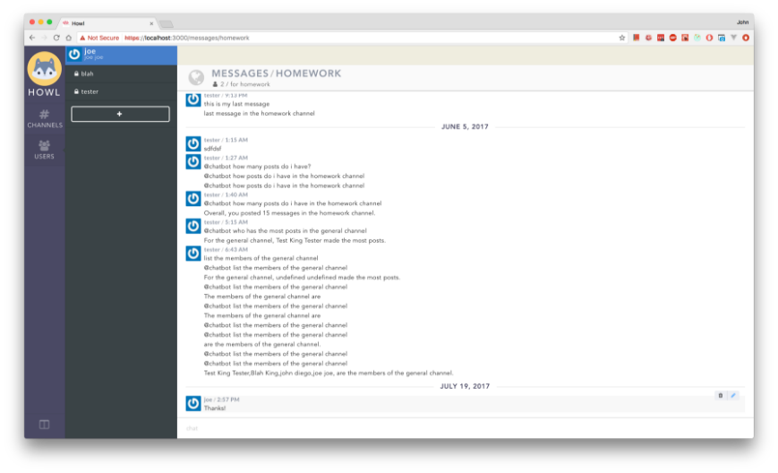

# Howl

<p align="center">
  
</p>

Howl is an instant messaging web application, similar to Slack, which I built to learn more about server-side programming. 

## Features
- Instant message anyone who has created an account
- Create public or private channels
- A chatbot that answers simple questions about chat logs
- Account authentication during sign in
- Storing sessions
- Add/Remove users from a channel

## Built With
- MongoDB: NoSQL database program
- Redis: In-memory data structure store for caching
- React: Javascript library for building user interfaces
- Redux: State management system
- Docker: Software container platform for deploying apps
- Go: Programming language used for API server

## Development

See [backend development guide](apiservers/README.md) for more on how to setup backend servers for development

The frontend client can be started using the commands below within the client directory
```
npm install
HTTPS=true npm start
```
