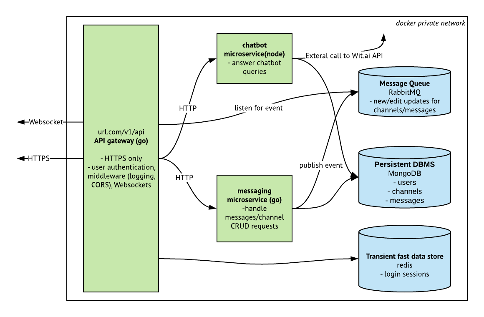

# Howl

Howl is an instant messaging web application, similar to Slack, that features a microservice architecture and a React-Typescript web client.

## Features
- Realtime instant messaging through websockets
- Create public/private channels or DM someone directly
- A chatbot that answers simple questions about chat logs
- Account authentication during sign in
- Storing sessions
- Add/Remove users from a channel

## Software Architecture

### Frontend
The web client is was bootstrapped with React with Typescript, using [CRA](https://github.com/wmonk/create-react-app-typescript). Redux was also used to manage application state and react-router to handle client-side routing.

### Server side




The API server uses a **microservices architecture** to decouple the multiple components that comprises the whole API server. Any request sent to the API server first has to go through the API gateway. 

The **[gateway](https://github.com/jadiego/react-slack-clone/tree/master/servers/gateway)** is responsible for being the gateway for all client requests for user or messaging data, or to other microservices. The only exposed port is 443, meaning all incoming HTTP requests must be over SSL. 

**[messaging](https://github.com/jadiego/react-slack-clone/tree/master/servers/messaging)** is responsible for interacting with the channels and message data on mongoDB.

**[chatbot](https://github.com/jadiego/react-slack-clone/tree/master/servers/chatbot)** is responsible for answering simple chatbot queries.

## Development

See [backend development guide](apiservers/README.md) for more on how to setup backend servers for development on local machine. A `docker-compose.yml` has been provided in order to run the proper Docker instances with a simple command.
```
docker-compose up
```

The frontend client can be started using the commands below within the client directory.
```
npm install
HTTPS=true npm start
```
